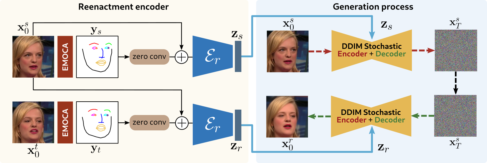
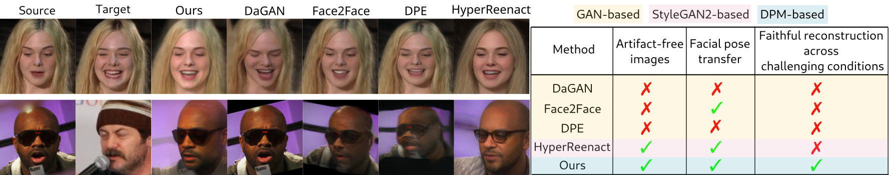

# DiffusionAct: Controllable Diffusion Autoencoder for One-shot Face Reenactment

Authors official PyTorch implementation of the **[DiffusionAct: Controllable Diffusion Autoencoder for One-shot Face Reenactment](https://arxiv.org/abs/2403.17217)**. If you use this code for your research, please [**cite**](#citation) our paper.

<p align="center">

</p>

>**DiffusionAct: Controllable Diffusion Autoencoder for One-shot Face Reenactment**<br>
> Stella Bounareli, Christos Tzelepis, Vasileios Argyriou, Ioannis Patras, Georgios Tzimiropoulos<br>
>
> **Abstract**: Video-driven neural face reenactment aims to synthesize realistic facial images that successfully preserve the identity and appearance of a source face, while transferring the target head pose and facial expressions. 
Existing GAN-based methods suffer from either distortions and visual artifacts or poor reconstruction quality, i.e., the background and several important appearance details, such as hair style/color, glasses and accessories, 
are not faithfully reconstructed. Recent advances in Diffusion Probabilistic Models (DPMs) enable the generation of high-quality realistic images. To this end, in this paper we present DiffusionAct, a novel method that leverages the photo-realistic 
image generation of diffusion models to perform neural face reenactment. Specifically, we propose to control the semantic space of a Diffusion Autoencoder (DiffAE), in order to edit the facial pose of the input images, defined as the head pose 
orientation and the facial expressions. Our method allows one-shot, self, and cross-subject reenactment, without requiring subject-specific fine-tuning. 
We compare against state-of-the-art GAN-, StyleGAN2-, and diffusion-based methods, showing better or on-par reenactment performance. 


<a href="https://arxiv.org/abs/2403.17217"></a>
<a href="https://stelabou.github.io/diffusionact/"></a>


<p align="center">

</p>


# Installation

* Python 3.5+ 
* Linux
* NVIDIA GPU + CUDA CuDNN
* Pytorch (>=1.5)

We recommend running this repository using [Anaconda](https://docs.anaconda.com/anaconda/install/).  

```
conda env create -f environment.yml
```

# Pretrained Models

|  Path | Description | Destination Folder |
| :--- | :---------- | :------------------ |
|[DiffAE](https://drive.google.com/file/d/1QKmwW9-yHcC91_f-Mq4maQLdgFrffmdW/view?usp=sharing)  | [DiffAE](https://github.com/phizaz/diffae) trained on FFHQ dataset. | Extract ffhq256_autoenc.zip under `./checkpoints`.
|[DiffusionAct-net](https://drive.google.com/file/d/1_pBdrega9Q38BYKx2-V1RavTYyG2BSpv/view?usp=sharing)  | Our model  trained on VoxCeleb1 dataset. | Save under `./pretrained_models`.
|[face-detector](https://drive.google.com/file/d/1IWqJUTAZCelAZrUzfU38zK_ZM25fK32S/view?usp=share_link)  | Pretrained face detector taken from [face-alignment](https://github.com/1adrianb/face-alignment). | Save under `./pretrained_models`.
|[gaze-estimator](https://drive.google.com/file/d/1OkzpEkAbI8WugxO7l514JwkYoWqhcnkT/view?usp=sharing) | Pretrained gaze estimator taken from [ETH-XGaze](https://github.com/xucong-zhang/ETH-XGaze). | Save under `./pretrained_models`.
|[EMOCA model](https://drive.google.com/file/d/1iVNqIvNEHYKtnqsk6h4m7kRXLn5wqGNf/view?usp=sharing)  | Pretrained model taken from [EMOCA](https://github.com/radekd91/emoca). | Extract EMOCA.zip under `./pretrained_models`.


# Inference 

Please download and place all required pretrained models in their specified directories as listed above.

Given as input a source (.png or .jpg) and a target frame (.png or .jpg), reenact the source face. 
```
python run_inference.py --source_path ./demo_run/source.png --target_path ./demo_run/target.png --output_path ./demo_run/results 
```


## Citation

```bibtex
@InProceedings{bounareli2024diffusionact,
    author    = {Bounareli, Stella and Tzelepis, Christos and Argyriou, Vasileios and Patras, Ioannis and   Tzimiropoulos, Georgios},
    title     = {DiffusionAct: Controllable Diffusion Autoencoder for One-shot Face Reenactment},
    journal   = {IEEE Conference on Automatic Face and Gesture Recognition},
    year      = {2025},
}
```

